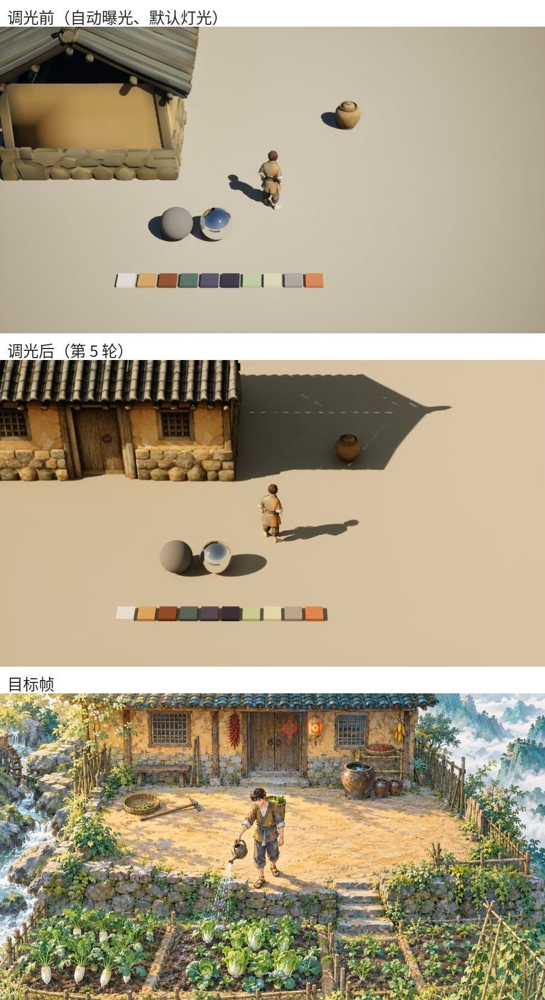
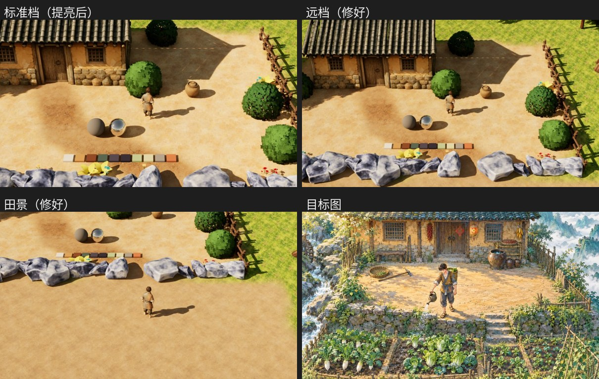

# 渲染落地计划 · 从白模到"像画出来的 3D"

> 编号：ART-RND-003 · 版本：1.8 · 建立：2026-09-27 · 更新：2026-10-01 · Owner：美术负责人
> 类型：**实施计划**。回答"画面现在为什么淡、按什么顺序把它调对、每步怎么验收"。风格本身以 [美术方向](../00-美术方向.md) 与 [色彩与光线设定](../02-色彩与光线设定.md) 为准，本文不复述。
> 状态：计划草案（2026-09-27 负责人同意撰写）。参数均为起始值，以实机调画面关卡为准；**本文不证明任何一步已完成**。
> 对应批次：[生产台账](../../生产台账/00-首件与批次台账.md) **V02 风格首件**（第 1、3、5 步）与 **V05 昼夜与季节**（第 2、4、6 步）。
> **2026-10-01 方向调整**：[美术方向 4.0](../00-美术方向.md) 改为对标《牧场物语 来吧！风之繁华集市》的卡通渲染：角色与可交互物卡通着色并描边、饱和度放宽、世界不叠纸纹。本文 §二、第 0 步冲突表、第 3、5、6 步已按此同步；第 1–2 步的历史记录保留原样。
> **2026-10-01 截图复核修订**：现行范围与形态以 [美术方向 §四](../00-美术方向.md) 为准；不要求所有交互物严格两档、统一暖阴影或都描边。旧道具色板与明度范围退役，参考截图只用于观感对齐。下文历史试验数值不因文案修订成为当前实测或已完成效果。
> 相关：[渲染研究](00-渲染研究结论-纸张与水彩质感论文评估.md) · [水彩实现指南](01-水彩手绘风实现指南.md) · [相机与空间合同](../../美术准则/01-相机与空间合同.md) · [性能预算](../../美术准则/06-性能预算与技术合同.md)

---

## 一、问题：负责人反馈"画面淡淡的"

2026-09-27 在 `L_FarmHillside` 用游戏机位截图，对照主角概念图与氛围图，原因不是"风格选错了"，而是**目前根本没有做风格**：画面仍是 UE 默认渲染加白模。

| 看到的 | 直接原因 | 由哪一步解决 |
|---|---|---|
| 整体发灰、没有明暗主次 | 没有后处理体积，**自动曝光**在工作；`DefaultEngine.ini` 的局部曝光把高光与暗部对比都压到 0.8 | 第 2 步 |
| 阴影是平的、没有冷暖 | 太阳是搭建脚本放的默认值（−45°、默认强度与色温），天光把阴影几乎填平，且是中性灰 | 第 2 步 |
| 时段没有变化 | 没有时段光照驱动，太阳不随游戏时钟动 | 第 4 步 |
| 地面一整片饱和橙色平铺纹理 | 白模地表材质，平铺重复、无大尺度色斑，饱和度超出色板约束 B | 第 3 步 |
| 灰盒子、主角灰衣且与概念不符 | 白模阶段，正式资产未入；主角贴图尚未按 §2.4 角色色重画 | 第 1、3 步，V04 |
| 雾没有层次 | 高度雾是默认值，没有按时段与深度分层 | 第 6 步 |

> 结论：先把**光与曝光**这一层做对（便宜、全局生效），再做**材质与贴图**（画意的主要来源），最后才做**后期统一**。顺序反过来就是"用后期救贴图"，已被 [美术方向 §四](../00-美术方向.md) 禁止。

---

## 二、边界（沿用现有方向，不新增规则）

1. **画面分层**：以 [美术方向 4.0 §四](../00-美术方向.md) 的分层表为准（2026-10-01 起不再用"贴图 60%／光照 30%／后期 10%"的比例）。
2. **关闭气氛后期与雾后，造型、固有色和贴图仍统一**。核心描边／卡通着色若由后期实现，单独切换并另附全关诊断图，验收口径按 [美术方向 §四、§六](../00-美术方向.md)。
3. **不改引擎源码**。场景表面保持 Default Lit（Substrate 下的默认 Slab），风格靠贴图与光；角色卡通着色与指定目标描边用材质或后期实现，方案在第 5 步比选。交互物保留体积渐变和局部切面，不统一压成严格两档。
4. 色彩约束以 [色彩与光线 §二](../02-色彩与光线设定.md) 现行条款为准；旧道具 HEX、留白、L 0.24–0.80 与禁纯黑／纯白的全局硬门槛已退役，不用它们校色新资产。
5. 分层明度：**背景淡、地面最平、焦点层（角色、成熟作物、交互物）对比最高**（色彩与光线 §三）。
6. 雾岚纪律：衬托深度与冷暖，**不遮目标格、作物状态和交互物**（色彩与光线 §六）。
7. **世界画面不叠纸纹**（色彩与光线 3.0 §七；原"冷压水彩纸、整屏 5%"作废）。
8. 性能：PC 1080p / 60 fps（[性能预算](../../美术准则/06-性能预算与技术合同.md)）；每步记录 GPU 耗时。

### 2.1 水彩实现指南（ART-RND-002）中已过时的条款

[01-水彩实现指南](01-水彩手绘风实现指南.md) 写于 09-18。**2026-10-01 起整份指南只作历史参考**（已在其文件头注明）；下表保留作对照，以右列为准。

| 指南原文 | 现行裁定 | 出处 |
|---|---|---|
| 贴图 80% ＋ 光照 15% ＋ 后期 5% | 不再用比例，按分层表 | 美术方向 4.0 §四 |
| 纸纹用宣纸细纹＋纤维丝 | 世界画面不叠纸纹 | 色彩与光线 3.0 §七 |
| 色名含"月白" | "月白"已作废，纸底为暖白 #F6F2E7 | 色彩与光线 §二（09-21） |
| PP1 风格化光照（软分档）为核心 | 角色采用概括亮暗，交互物允许渐变与切面，场景不强制分档 | 美术方向现行 §四 |

---

## 三、工程现状实查（2026-09-27）

| 项 | 现状 | 影响 |
|---|---|---|
| 全局光照／反射 | Lumen（`r.DynamicGlobalIlluminationMethod=1`、`r.ReflectionMethod=1`），硬件光追开，无静态光照 | 时段可完全动态；Lumen 是否保留待 P-6 |
| 阴影 | 虚拟阴影贴图（VSM） | 软阴影宽度可用太阳 Source Angle 调 |
| 材质系统 | Substrate 开 | 母材质用默认 Slab，别引入多层 Slab |
| 曝光 | 无 PostProcessVolume → 自动曝光；局部曝光对比 0.8／0.8 | **"淡"的主因之一** |
| 灯光 Actor | `level_farmhillside_build.py` 放置 DirectionalLight、SkyAtmosphere、SkyLight、ExponentialHeightFog，全部默认参数 | 无时段、无冷暖 |
| 时钟 | `UMistGameClockSubsystem`（World 层）有 `OnGameTimeChanged`、`OnDayStarted`、`OnSeasonChanged` | 时段驱动可直接订阅 |
| 母材质 | `/Game/MistRoost/Art/Common/`：`M_Env_Master3D`（含淡出通道）、`M_Env_Card_Masked`、`M_Env_Landscape`、`M_Env_FarmSoil`、`M_Env_Soil` | 在现有母材质上扩展，不另起一套 |
| 后期 | `M_PP_InkOutline` 已存在，未在关卡中启用 | 第 5 步描边的候选实现之一（需改为只描标记过的物体） |
| 作物 | `crop_cards_import.py` 导入的卡片 | 第 3 步改为 3D 分阶段网格（见 §4.3） |
| 调画面关卡 | 不存在 | 第 1 步新建 |
| 天空与天气（2026-10-01 补） | Ultra Dynamic Sky／Weather 9.7 放在 `Content/UltraDynamicSky/`，已接入沙盒 `L_FarmHillside_Dress`（原有太阳、天光、大气、高度雾和天空穹顶已删除）；正式图 `L_FarmHillside` 仍是上面的默认四件灯光 | 第 4 步改由 UDS／UDW 承担，见第 4 步 |

---

## 四、步骤

每一步都产出：**开／关对比截图、参数表、`stat gpu` 耗时**，交负责人签核后才进下一步。

### 第 0 步　目标画面（✅ 负责人已选定，2026-09-27）

**选定目标帧**：`概念设计/场景/渲染氛围图.png`（负责人按 07 提示词自行生成）。

> **2026-10-01**：风格主参考改为《风之繁华集市》截图（工作区 `概念设计/主要参考游戏/_最主要：牧场物语风之繁华集市/`，实测见 [色彩与光线 §2.5](../02-色彩与光线设定.md)）。本目标帧降为中式元素、布局与暖阳的参考。
- 取景是"实机一屏"：老屋正面、院坝、石坎石阶、菜田；左边溪流跌水，右边青绿远山和云海。
- 主角对齐 testa：暖赭／灰青短衣、灰蓝腰带、草鞋、背篓。
- 负责人评价："没有之前那么灰白了"。

**实测（900 px 缩图，HSL，与色彩与光线 §二 同一口径，逐像素统计）**：

| 区域 | S 均值 | S > 0.55 占比 | L 均值 | 说明 |
|---|---|---|---|---|
| 整图 | 0.33 | 17.5% | 0.49 | 整体并不艳，"不灰"主要来自明暗对比与暖阳 |
| 院坝地面 | **0.62** | **61%** | 0.66 | 全图最饱和、最亮的一块，是人物的"舞台" |
| 人物 | 0.49 | 43% | 0.58 | 焦点层 |
| 远山云海 | 0.20 | 0.7% | 0.71 | 背景淡，合乎分层 |
| 阴影（院坝） | — | — | — | 暖褐 #6C5A41，**不是灰青**；受光面 #FBD69D |

**与现行设定的冲突**（负责人 09-27 表示饱和度约束可以调，先看实机效果；**以下规则均未修改**）：

| # | 现行条款 | 目标帧的做法 | 影响 |
|---|---|---|---|
| ~~K-1~~ | 美术方向 §三 "淡彩静谧：低饱和、柔和明暗"；风格一句话里的"淡彩" | 中饱和、明暗清楚、暖阳 | **已解决 2026-10-01**：美术方向 4.0 改为"明快温润"，风格一句话重写 |
| ~~K-2~~ | 美术方向 §四 "暖白日光、灰青阴影；不用高对比硬光"；色彩与光线 §四 白天"中性偏暖" | 金色暖阳，**清楚的投影**，竹叶斑驳光，暖褐阴影 | **已解决 2026-10-01**：两处都改为暖阳、投影清楚、暗部不发灰 |
| ~~K-3~~ | 色彩与光线 §二 约束 B：S ≤ 0.55 | 院坝与人物大面积超过 | **已解决 2026-09-27**：负责人同意放宽，色彩与光线 2.5 版改为分层上限（背景 0.40、地面与中景 0.65、焦点 0.80） |
| ~~K-4~~ | 色彩与光线 §三：地面层"低-中饱和" | 院坝是最饱和的一块；但纹理平整，"交互目标附近纹理对比更低"的硬规则仍满足 | **已解决 2026-10-01**：地面层改为"中" |
| ~~K-5~~ | 色彩与光线 §二、§九：四件道具是**唯一**风格基准，色板从它们量出 | 目标帧比道具更暖、更饱和 | **已解决 2026-10-01**：基准换为《风之繁华集市》截图；色板待新首件后重量（色彩与光线 D-7） |
| ~~K-6~~ | 旧道具赭红的排他限制 | 辣椒串、灯笼、门上菱形红纸是环境红色点缀 | **已解决 2026-10-01 本轮**：道具退出美术标准，旧排他限制作废；新环境红色仍随 D-4／D-7 在首件定色 |
| K-7 | 相机合同：标准档人物约占画面高度 1/7 | 人物约占 1/4.3，比近档（约 1/5.3）还近 | 实机里人物会比目标帧小；或调臂长（C-5） |
| ~~K-8~~ | 色彩与光线 §七：冷压纸纹可见 | 纸纹几乎看不出，更接近水粉 | **已解决 2026-10-01**：世界画面不叠纸纹 |

**不冲突**：主角服装与配色（色彩与光线 §2.4、角色设定）；布局（老屋坐北朝南、溪在西、院坝下一级是田、石坎石阶朝镜头，见 [首关](../04-首关-半山庄园.md)）；青绿远山与暖白云海；无黑描边；中式农家元素。

**对后续步骤的影响**：太阳暖金、投影清楚可作调画面起点；阴影冷暖按环境与时段判断，不要求天光统一偏暖；第 3 步贴图按材质与新方向调整，避免整体泛白；第 5 步世界纸纹关闭。第 2 步旧数值仅保留试验记录，首件再校准。

草图 v001（未采用，保留记录）

目的：定下同一场景在游戏机位下四种光线的样子，作为后续所有调整的对照标准。

**2026-09-27 负责人意见**：下表 v001 草图**不是想要的**。
- 关卡应接近 `美术资产/关卡/半山庄园/非完整关卡氛围.jpeg`；
- 人物是成人，接近 `美术资产/人物/NPC/立绘/testa占位`、`testb占位`，不是幼童；
- 风格要再发散：只有淡雅，没有中式美学的亮点，灰度太高。

随后改为：AI 助手写提示词，负责人自己生图挑选。原提示词路径为 `美术资产/_提示词块/07-场景目标帧_v001.md`（**当前文件缺失**，不重建旧风格内容），当时含五个风格方向、两种取景、四个时段。现行提示词入口见 [通用 v002](../../../../美术资产/_提示词块/00-通用_v002.md)；下表保留作历史记录。

| 文件 | 内容 | 对应 |
|---|---|---|
| [01_晨](目标帧_v001/01_晨.jpg) | 低角度暖光、长冷影、山谷薄雾 | 早晨 |
| [02_午](目标帧_v001/02_午.jpg) | 顶光短影、无雾、全天最清楚 | 白天 |
| [03_暮](目标帧_v001/03_暮.jpg) | 低角度橙光、蓝紫影、窗与灯笼渐亮 | 黄昏 |
| [04_雨雾](目标帧_v001/04_雨雾.jpg) | 阴天漫射、细雨、湿地面、远景化入纸白而院内清楚 | 天气 |
| 状态 | **未采用**（2026-09-27） | |

- 草图为 AI 生图，**只定光线、冷暖与层次，不定造型与尺寸**；房子取自 `美术资产/房屋/农舍主屋/`，大缸取自 `美术资产/场景/酿缸-大坛/`。
- 负责人选定后，从选中图上**吸取每个时段的 5 个关键色**（天空、阳光、阴影、雾、自发光），写进第 4 步的时段数据，作为起始值。

### 第 1 步　调画面关卡（V02）

新建 `/Game/MistRoost/_Sandbox/LookDev/L_LookDev_Render`。**只放对照物，不做玩法**；正式关卡不得引用它。

| 内容 | 用途 |
|---|---|
| 游戏相机（FOV 35°、Pitch −37.5°、标准档臂长 2700） | 所有截图用同一机位 |
| 18% 灰球、镜面球、色板卡（色彩与光线 §二 全部锚点色） | 分辨"是灯光的问题还是贴图的问题" |
| 农舍主屋、酿造大缸（本轮导入，见 §五） | 第一批真实资产 |
| 主角（现有） | 焦点层可读性 |
| 萝卜全部生长阶段、一块耕地（干／湿）、一段石坎、一棵树 | 与 V02 首件清单一致 |
| 调试开关：后期开关、雾开关、时间滑杆（直接改时钟） | 做开／关对比图。时间滑杆、时间流速、天气与季节切换已由游戏内天气调试面板提供（F9 或 `Mist.Weather.Debug`，2026-10-01）；后期开关、雾开关仍待做 |

- 选新建而不是改 `L_Greybox_Farm`：后者是白模回归测试关，调灯光会改变它的截图基准（见 §七 R-1）。

### 第 2 步　基准：锁曝光、定太阳与天光（V05 前置）　🟡 首轮已调，待负责人看实机

**2026-09-27 首轮结果**（负责人同意开始；脚本 `MistRoost/Tools/lookdev_render_light.py`，参数表在文件顶部，只改调画面关卡）：

| 项 | 取值 | 说明 |
|---|---|---|
| 曝光 | Manual，物理相机曝光关，补偿 **−0.7** | 这种模式下补偿值**越大越亮**；首轮按相反方向估，调了两轮才找对 |
| 局部曝光对比 | 1.0（高光、暗部） | 覆盖 `DefaultEngine.ini` 的 0.8 |
| Bloom／暗角 | 0.3／0 | |
| 太阳 | 俯仰 −35°、朝向 75°（从西偏南照来，影子落向画面右侧），10 lux，**5200 K**，Source Angle 1° | 4700 K 时整张图发棕 |
| 天光 | 强度 **2.8**，颜色 (1.0, 0.86, 0.72) | 0.9 时暗部近黑；颜色中性时阴影是灰的 |
| 高度雾 | 密度 0.004，起始 50 m，最大不透明度 0.5 | 白天基本不可见 |

| 实测（游戏机位，sRGB） | 调光前 | 调光后 | 目标帧 |
|---|---|---|---|
| 18% 灰球受光面 | 195, 188, 171 | 200, 180, 147 | — |
| 地面受光 | 200, 192, 173 | 214, 194, 162 | 251, 214, 157 |
| 人影 | 投影几乎看不出 | **84, 76, 60**（暖褐） | 108, 90, 65 |
| 地面亮暗比 | — | 2.55 | 约 2.3 |

- 结论：光和曝光这一层已接近目标；剩下的差距主要是**内容与贴图**（地面还是平板、没有植物石坎和作物、角色材质未换），属于第 3 步。
- 更正下方原计划的两处起始值：天光实际要**高于**默认值（不是降到太阳的 1/3）；阴影的暖色来自暖色天光，而不是灰青。
- 截图方法：`-game` 加 `-ExecCmds="Mist.ShotIn 8 quit"`，延时 8 秒截图后自动退出。延时与否测得的数值几乎相同，说明启动后很快收敛。

**2026-09-27 布景与地表**（负责人要求先用项目里的第三方树石看效果，再接地表贴图；只改调画面关卡，另有一处同步到正式地图，见下）：

- 布景：`MistRoost/Tools/lookdev_render_dress.py`，用 `/Game/RivermillAssets` 与 `/Game/HouseAlongRiver` 的树、灌木、石头、栅栏、花（授权未核实，只在沙盒）。Rivermill 灌木的笔触叶团最接近目标，说明植被母材质（第 3 步）的关键是：手绘叶片贴图 + 叶片插片 + 整团球形法线。
- 第三方资产的坑，已避开：
  - Rivermill 的草、灌木默认材质采样地形 RVT，没有 RVT 时发黑。
  - HouseAlongRiver 的小石子是扁片。
  - HouseAlongRiver 的 `SM_Tree_Combine` 与 `SM_Bush_*` 用 Billboard 材质，叶片在材质里撑开，网格包围盒只有树干。按包围盒放大到树高（×41–51）后，叶片卡变成铺满屏幕的巨片，远档与田景被整片挡住。
- 地表：`MistRoost/Tools/lookdev_render_ground.py` 用正式的 `M_Env_Landscape` 与分层资产铺一块 63 × 63 m 平地形。权重由脚本按关卡布局算出：院坝、门前土路穿过石排缺口、前景田土、其余草地。材质实例从正式地图的 `MI_Env_Landscape_FarmHillside` 复制层色。
- 负责人定的地表调整，**已同步到正式地图**（`MistRoost/Tools/farmhillside_ground_tune.py`）：
  - 草地贴图 `T_Env_Ground_Grass` 从 `草1.jpeg` 重新导入，原为 `草3`；`level_farmhillside_build.py` 同步改为草1。
  - `Tint_Courtyard` 设为 (1.35, 1.58, 1.95)。
  - `Tint_Path` 设为 (0.75, 0.72, 0.70)。
- 实测（游戏机位，院坝受光）：纯色地面 217, 182, 125；贴图原色 227, 179, 104（偏橙）；调整后 **235, 204, 149**；目标帧 251, 214, 157。
- 帧率（离屏 1600 × 900，RTX 4060）：调画面关卡约 120 fps，白模关约 147 fps。
- 已知小问题：
  - 田土层（耕土_基底）与院坝颜色太近，田不像田。
  - 农舍屋脊有缝，阴影里漏出一排光点，改模型时处理。
- **2026-10-01 曝光改由 UDS 管**（负责人定 UDS 全接管天空和时段）：下面第 1 条的手动锁曝光只保留在调画面关卡 `L_LookDev_Render`，作为静态对照基准。接入 UDS 的关卡由 UDS 按昼夜调曝光；关卡里的 PostProcessVolume 不再覆盖曝光，只管 Bloom、饱和度、对比度、暗角等。上表的太阳、天光数值改作在 UDS 里调白天画面时的参照。
- 其余步骤仍以下列原计划为准：

1. 放一个 Unbound 的 PostProcessVolume：
   - 曝光 Metering Mode = **Manual**，关掉自动曝光；调曝光补偿，使阳光下 18% 灰球落在画面中灰。
   - 局部曝光对比恢复为 1.0（不压暗部和高光）。
   - Bloom 低、暗角关、运动模糊按 C-3 决定。
2. 太阳：色温偏暖（白天约 5500–6000 K），Source Angle 放大到 2–4°，得到**软边但仍清楚的影子**。
3. 天光：强度降到太阳的约 1/3 起步，颜色偏**灰青**（黛瓦青方向），让阴影是冷色而不是灰色。
4. 高度雾先调到几乎不可见，第 6 步再加回来。
5. 验收：灰球亮面暖、暗面冷，两者明度差明显；色板卡在画面中不偏色；平铺地面上仍能看出投影。

> 这一步做完，画面"淡"的问题应当去掉一大半，而且对所有资产同时生效。

### 第 3 步　母材质与作物模板（V02）

**2026-09-27 母材质方案已定**（负责人把母材质交给 AI 助手负责）。依据是沙盒布景 `L_FarmHillside_Dress` 用 SurvivalKit 课程资产（仅学习，授权未核实）做出的实机效果：氛围主要来自①草、石吃地面颜色（RVT 融合），②植被整团受光（球形法线）与风，③世界空间的手绘色斑，④干净的天空与两色调卡通云。下面只取做法，**不复制 SurvivalKit 的节点图和贴图**。

原则：
- 按渲染方式分母材质，一类一个；共用功能做成材质函数 `MF_Env_*`，外观差异只在材质实例里调参数。
- 场景表面一律 Default Lit（Substrate 默认 Slab）；只有云用 Unlit。角色与可交互物另有母材质（见表末行与第 5 步）。
- AI 生成贴图先用 `MF_Env_ColorAdjust`（亮度、饱和度、色相）在实例里拉进色板，拉不进再重画。

| 母材质 | 用途 | 功能 | 状态 |
|---|---|---|---|
| `M_Env_Master3D` | 建筑、道具、树干、石坎、石头 | 现有功能（淡出、LOD 抖动、`BaseColorTex × Tint`），加 `MF_Env_ColorAdjust`、`MF_Env_MacroTint`（世界空间低频色斑），静态开关"贴地融合"（墙脚、石头下缘取地形 RVT 颜色），湿润与季节读 `MPC_Env_World` | 扩展 |
| `M_Env_Foliage`（新） | 树冠、灌木、草、作物叶 | Masked、双面、Default Lit；球形法线（以实例中心为球心）、风摆（`MPC_Env_World` 风力）、根部取地形 RVT 颜色（草与地面同色）、抖动淡出与遮挡淡出、`MF_Env_ColorAdjust` | 新建，即 [植被生成指南](../../美术准则/09-植被生成指南.md) 里"⬜ 待建"的植被母材质 |
| `M_Env_Landscape` | 地表 | 现有六层，加 RVT 输出（颜色 + 高度）和宏观色斑 | 扩展；RVT 输出已在沙盒验证 |
| `M_Env_Water`（新） | 溪、潭 | 半透明；按水深渐变不透明度、岸边细白沫线、流动法线；颜色低饱和青 | 新建；参数取自沙盒调好的值 |
| `M_Env_Cloud`（新） | 云海卡片 | Unlit；云卡片白色受光、天蓝阴影、硬边 | 新建；沙盒已有原型 `M_SKD_AnimeCloud`。天空已由 UDS 承担（第 4 步），`M_Env_SkyDome` 不再需要 |
| `M_Env_Card_Masked` | 旧卡片作物、植被 | 冻结，新资产不再用；作物换成 3D 分阶段网格后退役 | 冻结 |
| 角色、指定交互目标 | — | 着色与描边范围按美术方向 §四；运行时比选见第 5 步，不要求所有交互物使用同一分档材质 | 不在本方案 |

共用件：`MPC_Env_World`（时段、季节、湿润、风力、自发光强度），项目自己的 RVT 资产 `RVT_Env_Color`、`RVT_Env_Height`（不引用 SurvivalKit 的 RVT）。

实施顺序（每项先在调画面关卡和沙盒里对比，签核后才进正式关卡）：
1. `MPC_Env_World`、`MF_Env_ColorAdjust`、`M_Env_Foliage`：在沙盒里用它替换 SurvivalKit 的草、树材质，并排对比。
2. `M_Env_Landscape` 加 RVT 输出。正式关卡要摆 RVT 体积，属于改正式关卡，届时另问负责人。
3. `M_Env_Water`，替换沙盒里的课程水材质。
4. `M_Env_Cloud` 由沙盒原型转正（天空穹顶已由 UDS 取代）。
5. `M_Env_Master3D` 扩展（色斑、贴地融合、湿润与季节）。

- 世界画面不叠纸纹（2026-10-01）。
- 笔触与色斑**画进贴图**，不靠程序生成；木纹、砖缝、叶脉等结构线允许，屏幕外描边与方向投影不烘入贴图；描边范围按美术方向 §四（第 5 步）。

**作物模板（萝卜）**：珊瑚岛的作物是 3D 分阶段模型（低模＋手绘叶片卡），本项目照此做。

1. 每个生长阶段一个 Static Mesh（`SM_Crop_Radish_S0…S4`），叶子为手绘卡片、根茎有体积；共用一张贴图。
2. 植被母材质提供风摆；浇水与成熟的"弹一下"由代码缩放完成，不做骨骼。
3. 同类作物用实例化渲染（ISM／HISM）。
4. 成熟阶段属于焦点层：对比略高于周围地面；夜间需要可读性补偿（色彩与光线 §四）。
5. 萝卜跑通后作为其他作物的模板，写回 [3D场景资产管线](../../美术准则/02-3D场景资产管线.md)（需负责人同意）。

### 第 4 步　时段与天气（V05）　改由 Ultra Dynamic Sky／Weather 承担（2026-10-01）

负责人 2026-10-01 定：天空和时段全部交给 Ultra Dynamic Sky（UDS），天气交给 Ultra Dynamic Weather（UDW）。不再自建时段配置资产和时段曲线；"程序不写死任何颜色"这一条照旧。

- **分工**：
  - UDS：太阳、月亮、天光、天空、高度雾、体积云、昼夜曝光。
  - UDW：云量、雨、雪、雷电、雾量、地面湿润。
  - 包整体放在 `Content/UltraDynamicSky/`，不改包内资产；放 UDS 的关卡要先删掉原有的太阳、天光、大气、高度雾和天空穹顶。
- **驱动**：
  - 游戏时钟是唯一的时间源。`UMistWeatherPresentationSubsystem`（World 层）关掉 UDS 自己走时，每帧把游戏时刻写进 UDS 的 `Time of Day`；睡觉跳时，画面直接到新时刻。
  - 天气服务 `UMistWeatherSubsystem` 每天按季节权重掷骰决定天气，表现层据此切换 UDW 预设：换天、读档时直接到位，白天切换按表中过渡秒数渐变。季节交给 UDW 的手动季节模式。
  - 室内和矿洞用遮蔽接口，固定为晴天正午，不受外面天气影响。
- **数据**：
  - 时段颜色、强度在关卡里 UDS 实例的参数上调。
  - 天气在 UDW 预设（`UltraDynamicSky/Blueprints/Weather_Effects/Weather_Presets/`）里调。天气类型与预设的对应、过渡时间、是否浇水，配在 `DT_Weathers`。
- **材质参数集** `MPC_Env_World`：保留，内容仍是时段、季节、湿润、风力、自发光强度，材质只读它，不直接读时钟或 UDS。数据来源改为：时段、湿润、风力取自 UDS／UDW，季节取自时钟，由表现层子系统写入（待做）。
- **夜晚不是把白天压暗**：夜间主要信息源是窗、灯笼、炉火的自发光，以及交互物和成熟作物的局部补偿（色彩与光线 §四）。UDS 的夜间亮度只作底色。
- 天气不再是"时段曲线上的覆盖层"：雨、雾、云量都由 UDW 预设统一改，时段照旧由 UDS 按游戏时刻计算。
- 范围：目前只接沙盒 `L_FarmHillside_Dress`；正式图何时接入，等本步验收后由负责人定。
- 验收：同一机位出晨／午／暮／夜四张截图，再加雨、岚日各一张，与第 0 步选定的目标帧并排对比；关掉全局时段色后，夜晚仍能靠自发光读出来；按第 2 步的方法记 `stat gpu` 帧时（UDS 默认带体积云）。

### 第 5 步　卡通着色、描边与后期统一（2026-10-01 改）

角色与小中型交互目标的着色和描边以 [美术方向 §四](../00-美术方向.md) 为准；树冠、建筑、山体与装饰草花仍按场景处理。截图只能支持可见的轮廓与色面特征，不能证明其描边算法、精确档数或线条均为同色系。下表是本项目首件的实现候选与起始值。

| 层 | 做法 | 起始值 |
|---|---|---|
| 描边 | 首件比选两种实现：① 反向外壳（UE 网格组件的 Overlay Material，背面沿法线外扩），线宽随距离修正；② 自定义深度／模板标记 + 后期描边（`M_PP_InkOutline` 改为只描带标记的物体）。比较线宽稳定性、遮挡表现、`stat gpu` 耗时 | 1080p 约 1.5–2 px；颜色为固有色压暗，L 约 0.1–0.25 |
| 卡通明暗 | 角色以亮暗两组概括，保留面部与衣服体积；矿石、作物、小道具保留柔和渐变和局部切面。暗部冷暖随环境，不统一染暖或冷。实现方案随首件比选，不改引擎源码 | 首件定 |
| 设色 LUT | UE 标准 Color Grading LUT；每个时段一张，随时段混合 | 以主参考观感校准，不能从最终截图唯一反推出 LUT |
| ~~纸纹~~ | 2026-10-01 取消（世界画面不叠纸纹） | — |
| 远景褪色 | 远处按深度向天空色过渡 | 与第 6 步一起调 |
| 景深（可选） | 主参考屏幕上沿有轻微虚化 | 默认关，出开／关对比图 |

- 验收：同一机位里通过形状、色块、阶段、克制描边与提示读出交互目标，场景和整片田不被线条弄脏；气氛后期与核心着色分开切换，按 §二检查。

### 第 6 步　雾岚分层

- **高度雾**：给整体深度与时段色，玩法区域（院子、田）保持清楚。接入 UDS 的关卡由 UDS 提供高度雾，雾量随天气由 UDW 控制，本步在其参数上调。
- **局部雾体**（Local Fog Volume）：只放在山谷、台地边缘、溪流上方，做出"晨岚"。
- **远景**：向天空色褪，而不是向灰色褪。
- 前景雨雪、世界粒子、远景雾三者分别控制（色彩与光线 §六）。
- 验收：晨与雨雾两个状态下，目标格、作物成熟状态、交互物全部可读。

---

## 五、本轮导入的两件资产

按出货箱先例（`Tools/farmhillside_props_build.py`、`美术资产/场景/箱子/出货箱/资产卡.md`）导入。**只放进调画面关卡，不改任何正式关卡。**

| 资产 | 源文件 | 工程路径 | 资产卡 |
|---|---|---|---|
| 农舍主屋 | `美术资产/房屋/农舍主屋/房屋.fbx`（贴图在 `房屋.fbm/`） | `/Game/MistRoost/Art/Env/Farmhouse/`：`SM_／T_／MI_Env_Farmhouse` | 放在源文件旁 `资产卡.md` |
| 酿造大缸 | `美术资产/场景/酿缸-大坛/酿造大缸/酿造大缸.fbx` | `/Game/MistRoost/Art/Env/BrewJar/`：`SM_／T_／MI_Env_BrewJar` | 同上 |

- 材质实例父级为 `M_Env_Master3D`；按 FBX 原尺寸导入，导入后对照相机合同的世界尺度检查门高与缸高。
- 两件都是 AI 生模的基础色贴图，属于**试装**：用来检验灯光与母材质，不代表通过首件验收。

---

## 六、分工

| 步骤 | 可由程序／AI 助手完成 | 需要负责人 |
|---|---|---|
| 0 | 出草图 | **选定方向** |
| 1 | 用脚本建关卡、放对照物、导入两件资产 | 确认对照物清单 |
| 2 | PostProcessVolume、灯光参数、开／关截图 | 签核基准画面 |
| 3 | 材质函数、母材质参数、作物导入脚本 | **画贴图**；签核笔触尺度 |
| 4 | UDS／UDW 接入、表现层子系统、天气表、MPC、截图 | 在 UDS 参数与 UDW 预设上调颜色；签核各时段与天气 |
| 5 | 描边与卡通着色材质、LUT 混合、对比截图 | 签核描边与明暗；制作或确认 LUT |
| 6 | 雾体布置与参数 | 签核雾岚 |

---

## 七、待定问题

| # | 问题 | 建议 | 何时关闭 |
|---|---|---|---|
| R-1 | 调画面在新关卡 `L_LookDev_Render` 还是台账写的 `L_Greybox_Farm` | 新建，避免改动回归测试关的基准 | 第 1 步前 |
| ~~R-2~~ | ~~目标帧选哪个方向~~ | **已关闭 2026-09-27**：选定 `概念设计/场景/渲染氛围图.png` | — |
| R-7 | 第 0 步冲突 K-1～K-8 是否修订美术方向与色彩与光线设定 | K-3 已关闭；K-1、K-2、K-4、K-5、K-8 随美术方向 4.0 关闭；K-6 本轮随旧道具限制退役关闭，K-7 仍开 | 第 2 步后 |
| ~~R-3~~ | ~~时段曲线是连续插值，还是晨／午／暮／夜四个关键帧之间过渡~~ | **已关闭 2026-10-01**：时段交给 UDS，按游戏时刻连续计算 | — |
| R-4 | 是否保留 Lumen（即 P-6） | 在调画面关卡实测：Lumen 与"只用天光＋距离场 AO"两套各出截图和帧时 | V03 |
| ~~R-5~~ | ~~剪影辅助线（即 A-5）~~ | **已关闭 2026-10-01**：只描角色和可交互物，场景不描（负责人定） | — |
| ~~R-6~~ | ~~[水彩实现指南](01-水彩手绘风实现指南.md) 的过时条款是否在原文补注~~ | **已关闭 2026-10-01**：整份指南在文件头注明只作历史参考 | — |

---

## 八、变更记录

| 日期 | 版本 | 变更 |
|---|---|---|
| 2026-10-01 | 1.8 | 按本轮截图复核授权同步：取消严格两档、统一暖暗部与所有交互物描边的概括；按方向 §四验收，核心着色与气氛后期分开切换；退役旧道具明度与色值门槛，关闭旧赭红排他冲突 K-6；修正纸纹“下限”与截图反推 LUT 的表述。未改工程资产或宣称实机效果通过 |
| 2026-10-01 | 1.7 | 随美术方向 4.0（对标《风之繁华集市》，负责人同意同步改文档）：§二 第 1、2、3、4、7 条改；§2.1 指南整体只作历史参考；第 0 步主参考改为《风之繁华集市》截图，K-1、K-2、K-4、K-5、K-8 关闭；第 3 步角色与可交互物另设卡通描边母材质，天空穹顶材质取消；第 5 步改为卡通着色、描边与后期统一，纸纹取消；第 6 步远景向天空色褪；R-5、R-6 关闭，R-7 更新 |
| 2026-10-01 | 1.6 | 负责人定天空和时段由 Ultra Dynamic Sky／Weather 全接管（负责人同意同步改本文）：第 4 步改为 UDS 承担时段、UDW 承担天气，游戏时钟写入 UDS，天气预设配在 `DT_Weathers`，`MPC_Env_World` 保留并改从 UDS／UDW 取数；第 2 步注明接入 UDS 的关卡由 UDS 管曝光；第 1 步时间滑杆由天气调试面板提供；§三 补天空与天气现状；第 6 步、§六 同步；R-3 关闭 |
| 2026-09-27 | 1.5 | 第 3 步写入母材质方案（负责人把母材质交给 AI 助手决定）：按渲染方式分六个母材质、共用 `MF_Env_*` 与 `MPC_Env_World`、实施顺序；K-3 关闭（色彩与光线 2.5 版分层饱和度上限），§二 第 4 条同步 |
| 2026-09-27 | 1.4 | 第 2 步补记布景与地表：第三方树石的问题与规避、调画面关卡地形、帧率；负责人同意把草地贴图与院坝、土路层色同步到正式地图（已做） |
| 2026-09-27 | 1.3 | 第 2 步首轮（负责人同意开始）：调画面关卡五轮调光的参数、实测与对比图；更正天光强度与阴影颜色两处起始值 |
| 2026-09-27 | 1.2 | 第 0 步：登记负责人选定的目标帧 `概念设计/场景/渲染氛围图.png`、实测数据、与现行设定的冲突 K-1～K-8（未改规则）及对第 2、3、5 步的影响；R-2 关闭，新增 R-7 |
| 2026-09-27 | 1.1 | 第 0 步：记录负责人对草图 v001 的意见（未采用），目标帧改由负责人按 `07-场景目标帧_v001.md` 提示词生图；R-2 同步 |
| 2026-09-27 | 1.0 | 建立（负责人同意撰写）：画面偏淡的原因实查、边界、工程现状、第 0–6 步、两件资产导入、分工、待定问题；附目标帧草图 v001 四张 |
